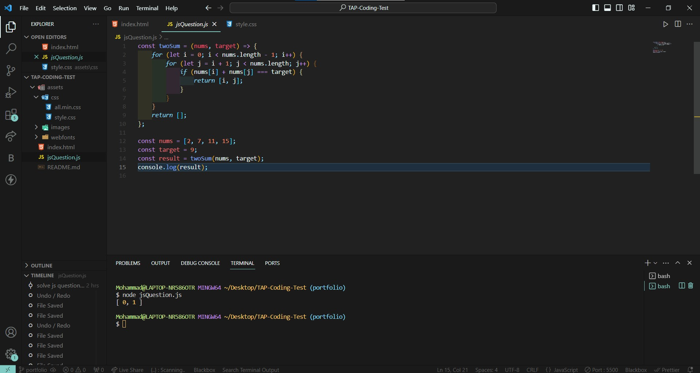

# TAP-Coding-Test

## Table Of Content

- [HTML & CSS Question](#HTML&CSS-Question)
- [Javascript Question](#Javascript-Question)
- [English assignment](#English-assignment)
- [Socials](#Socials)

### HTML & CSS Question

Personal portfolio website by using only HTML and CSS.

### Javascript Question

Given an array of integers nums and an integer target, return indices of the two numbers such that they add up to target.
You may assume that each input would have exactly one solution, and you may not use the same element twice.
You can return the answer in any order.
Input: nums = [2,7,11,15], target = 9
Output: [0,1]
Explanation: Because nums[0] + nums[1] == 9, we return [0, 1].

### English Assignment

### Socials

- Mohammad Halaweh

LinkedIn => https://www.linkedin.com/in/mohammad-halaweh-851110231/

Youtupe => https://www.youtube.com/channel/UC3gf4o1mZEBIuLFCLPDGRYQ

Email => mohammad.halaweh11@gmail.com
